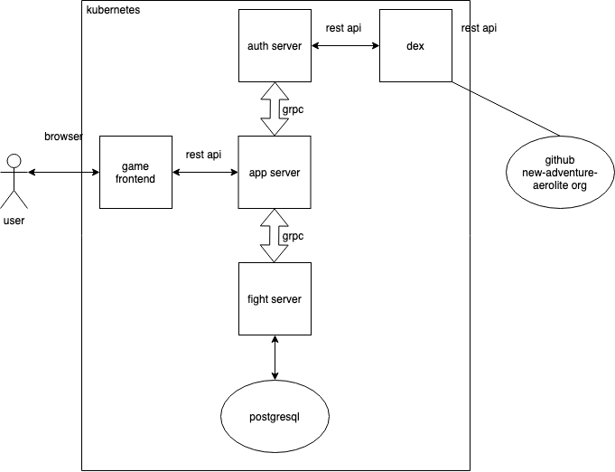

# game-frontend

game frontend is used for interactive between user and app-server.

## Overview



## installation

```sh
$ git clone https://github.com/new-adventure-aerolite/game-frontend.git

$ npm install

$ npm start
```

or just browser the web: https://rpg-game.eastus.cloudapp.azure.com/

## images source

got dist and img from the repo: [RPGUI](https://github.com/RonenNess/RPGUI)

## LICENSE

[MIT](./LICENSE)
